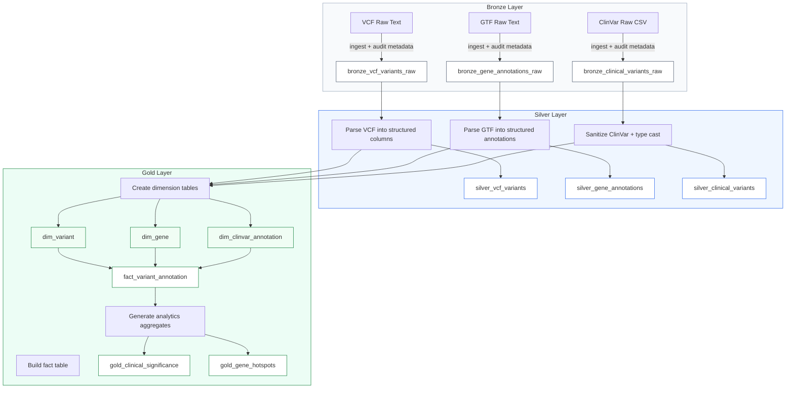
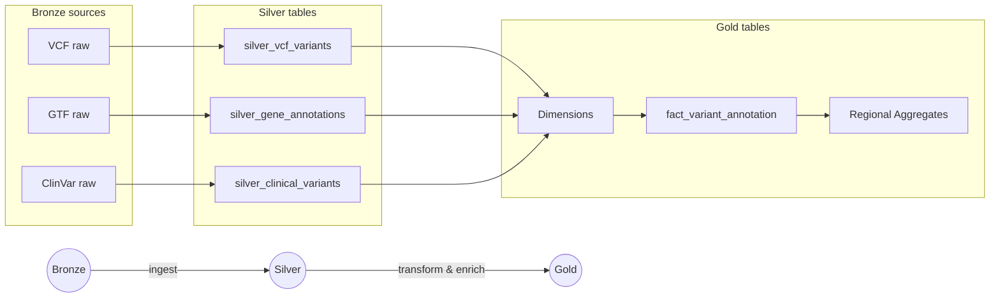
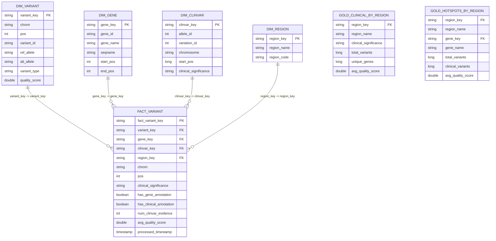

# Genomics ETL Pipeline Diagram

## Updated Data Model

This document now reflects the latest Databricks pipeline design and presents:
- A refreshed medallion pipeline diagram
- Separate dimension table definitions
- Separate fact table definitions
- Clear mapping from Bronze ? Silver ? Gold

---

## Pipeline Flow

---

## Key Notes
- Bronze layer preserves raw source data from VCF, GTF, and ClinVar.
- Silver layer produces typed, cleaned, and partitioned Delta tables.
- Gold layer separates dimensions from facts for analytics-ready modeling.
- The main fact table is `fact_variant_annotation`, supported by `dim_variant`, `dim_gene`, and `dim_clinvar_annotation`.

---

## Dimension Tables

### dim_variant
| Column | Type | Description |
|---|---|---|
| variant_key | string | Surrogate key for each unique variant |
| chrom | string | Chromosome code |
| pos | int | Variant genomic position |
| variant_id | string | VCF ID or generated identifier |
| ref_allele | string | Reference allele |
| alt_allele | string | Alternate allele |
| variant_type | string | SNP, INSERTION, DELETION, COMPLEX |
| quality_score | double | VCF QUAL score |
| filter_status | string | VCF FILTER field |
| is_high_quality | boolean | `filter_status == 'PASS'` |
| bronze_ingestion_timestamp | timestamp | Bronze ingestion metadata |
| source_file | string | Original source filename |

### dim_gene
| Column | Type | Description |
|---|---|---|
| gene_key | string | Surrogate key for each gene |
| gene_id | string | Gene identifier from GTF |
| gene_name | string | Standard gene symbol |
| gene_type | string | Gene biotype |
| seqname | string | Chromosome or contig |
| start_pos | int | Gene start coordinate |
| end_pos | int | Gene end coordinate |
| strand | string | `+` or `-` |
| length | int | End minus start + 1 |
| annotation_source | string | Source system, e.g. GENCODE v49 |

### dim_clinvar_annotation
| Column | Type | Description |
|---|---|---|
| clinvar_key | string | Surrogate key for ClinVar annotation |
| allele_id | int | ClinVar AlleleID |
| variation_id | int | ClinVar VariationID |
| chromosome | string | Chromosome code |
| start_pos | long | Variant start position |
| gene_symbol | string | Reported gene symbol |
| gene_id | int | Gene ID if available |
| clinical_significance | string | Pathogenicity label |
| review_status | string | ClinVar review status |
| phenotype_list | string | Associated phenotypes |
| pathogenicity_group | string | Normalized clinical class |

### dim_region
| Column | Type | Description |
|---|---|---|
| region_key | string | Surrogate key for a geopolitical/analysis region |
| region_name | string | Name (e.g. Africa, Europe, Asia, Americas, Oceania) |
| region_code | string | Short code (e.g. AF, EU, AS, AM, OC) |
| description | string | Optional human-readable description |
| source_population | string | Source of region mapping (metadata source)

---

## Fact Tables

### fact_variant_annotation
| Column | Type | Description |
|---|---|---|
| fact_variant_key | string | Surrogate fact row key |
| variant_key | string | FK to `dim_variant` |
| gene_key | string | FK to `dim_gene` |
| clinvar_key | string | FK to `dim_clinvar_annotation` |
| chrom | string | Chromosome code |
| pos | int | Variant position |
| variant_id | string | VCF variant identifier |
| gene_id | string | Gene identifier mapped via range join |
| gene_name | string | Gene symbol mapped via gene annotation |
| clinical_significance | string | ClinVar annotation captured from the join |
| has_gene_annotation | boolean | Whether gene mapping exists |
| has_clinical_annotation | boolean | Whether ClinVar annotation exists |
| num_clinvar_evidence | int | Count of ClinVar records per variant |
| avg_quality_score | double | Quality score for the variant |
| processed_timestamp | timestamp | Gold processing event time |
| region_key | string | FK to `dim_region` to indicate sample/analysis region |
| region_name | string | Denormalized region name (for query convenience) |
| sample_population | string | Population or cohort label mapped to region |

### gold_clinical_significance
| Column | Type | Description |
|---|---|---|
| clinical_significance | string | ClinVar grouping |
| total_variants | long | Number of variants with this label |
| unique_genes | long | Distinct genes impacted |
| distinct_positions | long | Distinct genomic positions |
| avg_quality_score | double | Average VCF quality for this group |
| pathogenic_variant_ratio | double | Percent of variants labeled pathogenic |
| rank_by_burden | int | Rank within clinical class |

### gold_clinical_significance_by_region
| Column | Type | Description |
|---|---|---|
| region_key | string | FK to `dim_region` |
| region_name | string | Denormalized region name |
| clinical_significance | string | ClinVar grouping |
| total_variants | long | Number of variants with this label in region |
| unique_genes | long | Distinct genes impacted in region |
| avg_quality_score | double | Average VCF quality for region/class |
| pathogenic_variant_ratio | double | Percent pathogenic in region |
| rank_by_burden | int | Rank within region and clinical class |

### gold_gene_hotspots
| Column | Type | Description |
|---|---|---|
| gene_key | string | FK to `dim_gene` |
| gene_name | string | Gene symbol |
| gene_type | string | Biotype |
| total_variants | long | Number of variants mapped to gene |
| clinical_variants | long | Variants with clinical annotation |
| snp_count | long | Count of SNPs |
| indel_count | long | Count of insertions/deletions |
| avg_quality_score | double | Mean VCF quality score |
| hotspot_rank | int | Dense rank by variant burden |

### gold_gene_hotspots_by_region
| Column | Type | Description |
|---|---|---|
| region_key | string | FK to `dim_region` |
| region_name | string | Denormalized region name |
| gene_key | string | FK to `dim_gene` |
| gene_name | string | Gene symbol |
| total_variants | long | Number of variants mapped to gene in region |
| clinical_variants | long | Variants with clinical annotation in region |
| avg_quality_score | double | Mean VCF quality for gene in region |
| hotspot_rank | int | Dense rank by variant burden within region |

---

## Gold Layer Data Flow

1. `silver_vcf_variants` provides core variant details.
2. `silver_gene_annotations` maps variants to genes using range join: `chrom = seqname AND pos BETWEEN start_pos AND end_pos`.
3. `silver_clinical_variants` enriches variants using position join: `chromosome = chrom AND start_pos = pos`.
4. `dim_variant`, `dim_gene`, and `dim_clinvar_annotation` are generated from Silver tables.
5. `fact_variant_annotation` joins all dimensions into a single analytics row.
6. Aggregate tables `gold_clinical_significance` and `gold_gene_hotspots` are computed from the fact table.

---

## Compact Pipeline Diagram

---

## Schema ER Diagram (compact)

