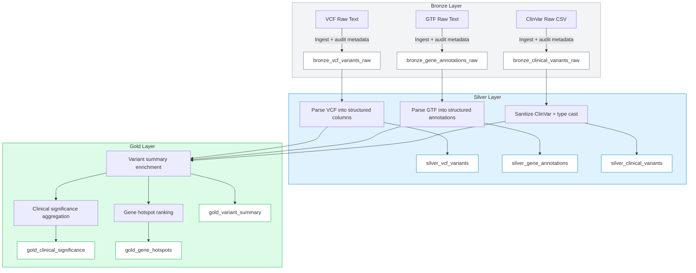
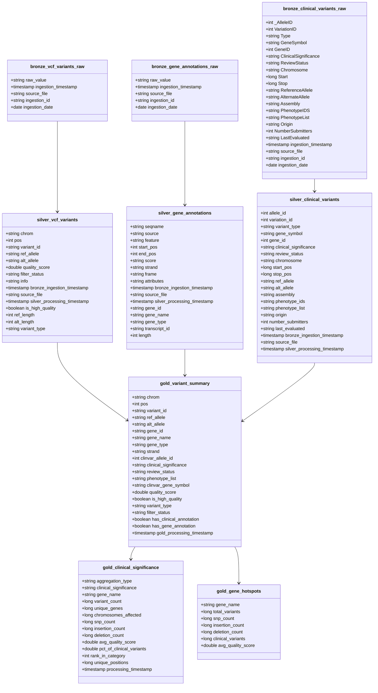

# Genomics ETL Pipeline Diagram

## Notes
- Bronze layer ingests raw genomic files with audit metadata and partitions by `ingestion_date`.
- Silver layer parses and validates raw text into structured Delta tables.
- Gold layer enriches variants, aggregates clinical significance, and ranks gene hotspots.

## Schema Diagram

### Schema Notes
- Bronze tables store raw content plus ingestion audit metadata.
- Silver tables are structured and enriched with parsed fields + processing timestamps.
- `gold_variant_summary` is the core joined fact table.
- Aggregation tables derive from `gold_variant_summary` for clinical and gene hotspot analytics.
