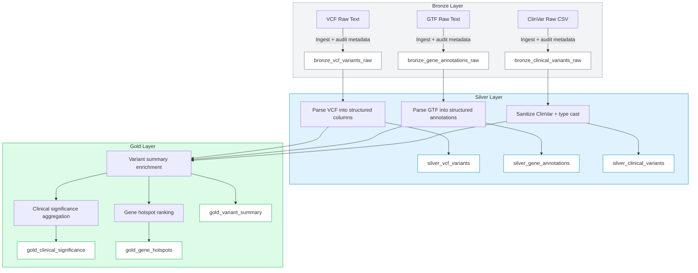
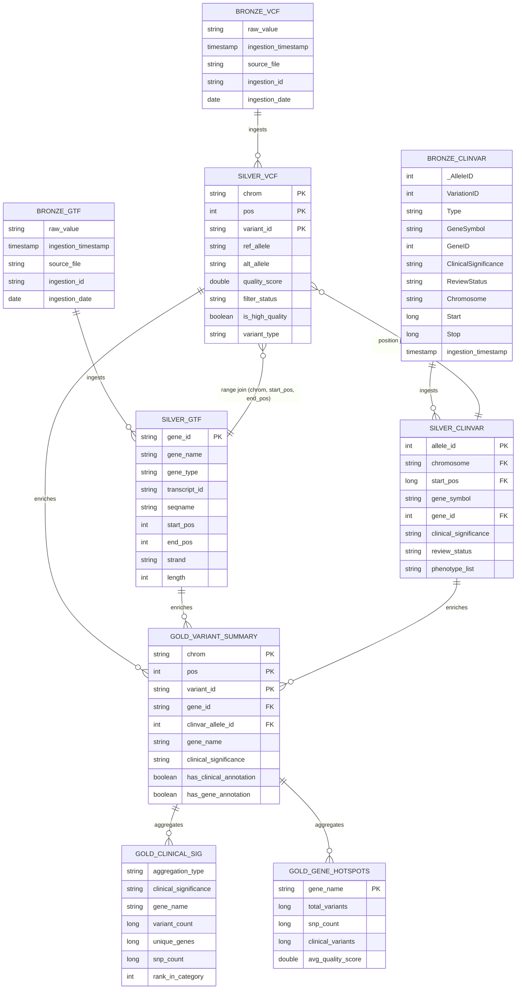

# Genomics ETL Pipeline Diagram

## Notes
- Bronze layer ingests raw genomic files with audit metadata and partitions by `ingestion_date`.
- Silver layer parses and validates raw text into structured Delta tables.
- Gold layer enriches variants, aggregates clinical significance, and ranks gene hotspots.

## Schema Diagram (ER - Dark Mode Optimized)

---

## Detailed Schema Tables

### **BRONZE LAYER**

#### bronze_vcf_variants_raw
| Column Name | Type Cast | Key Type |
|---|---|---|
| raw_value | string | - |
| ingestion_timestamp | timestamp | - |
| source_file | string | - |
| ingestion_id | string | - |
| ingestion_date | date | Partition |

#### bronze_gene_annotations_raw
| Column Name | Type Cast | Key Type |
|---|---|---|
| raw_value | string | - |
| ingestion_timestamp | timestamp | - |
| source_file | string | - |
| ingestion_id | string | - |
| ingestion_date | date | Partition |

#### bronze_clinical_variants_raw
| Column Name | Type Cast | Key Type |
|---|---|---|
| _AlleleID | int | - |
| VariationID | int | - |
| Type | string | - |
| GeneSymbol | string | - |
| GeneID | int | - |
| ClinicalSignificance | string | - |
| ReviewStatus | string | - |
| Chromosome | string | - |
| Start | long | - |
| Stop | long | - |
| ReferenceAllele | string | - |
| AlternateAllele | string | - |
| Assembly | string | - |
| PhenotypeList | string | - |
| Origin | string | - |
| NumberSubmitters | int | - |
| ingestion_timestamp | timestamp | - |
| source_file | string | - |
| ingestion_id | string | - |
| ingestion_date | date | Partition |

---

### **SILVER LAYER**

#### silver_vcf_variants
| Column Name | Type Cast | Key Type |
|---|---|---|
| chrom | string | PK |
| pos | int | PK |
| variant_id | string | PK |
| ref_allele | string | - |
| alt_allele | string | - |
| quality_score | double | - |
| filter_status | string | - |
| info | string | - |
| is_high_quality | boolean | - |
| ref_length | int | - |
| alt_length | int | - |
| variant_type | string | - |
| bronze_ingestion_timestamp | timestamp | - |
| source_file | string | - |
| silver_processing_timestamp | timestamp | - |

**Partition By:** chrom

**Joins To:**
- `silver_gene_annotations` via **range join**: `chrom = seqname AND pos BETWEEN start_pos AND end_pos`
- `silver_clinical_variants` via **position join**: `chrom = chromosome AND pos = start_pos`

---

#### silver_gene_annotations
| Column Name | Type Cast | Key Type |
|---|---|---|
| gene_id | string | PK |
| gene_name | string | - |
| gene_type | string | - |
| transcript_id | string | - |
| seqname | string | - |
| source | string | - |
| feature | string | - |
| start_pos | int | FK (to VCF) |
| end_pos | int | - |
| score | string | - |
| strand | string | - |
| frame | string | - |
| length | int | - |
| bronze_ingestion_timestamp | timestamp | - |
| source_file | string | - |
| silver_processing_timestamp | timestamp | - |

**Partition By:** seqname

**Joins To:**
- `silver_vcf_variants` via **range join**: Referenced by VCF (chrom, pos)

---

#### silver_clinical_variants
| Column Name | Type Cast | Key Type |
|---|---|---|
| allele_id | int | PK |
| variation_id | int | - |
| variant_type | string | - |
| gene_symbol | string | - |
| gene_id | int | FK (to Gene) |
| clinical_significance | string | - |
| review_status | string | - |
| chromosome | string | FK (to VCF) |
| start_pos | long | FK (to VCF) |
| stop_pos | long | - |
| ref_allele | string | - |
| alt_allele | string | - |
| assembly | string | - |
| phenotype_ids | string | - |
| phenotype_list | string | - |
| origin | string | - |
| number_submitters | int | - |
| last_evaluated | string | - |
| bronze_ingestion_timestamp | timestamp | - |
| source_file | string | - |
| silver_processing_timestamp | timestamp | - |

**Partition By:** chromosome

**Joins To:**
- `silver_vcf_variants` via **position join**: `chromosome = chrom AND start_pos = pos`

---

### **GOLD LAYER**

#### gold_variant_summary
| Column Name | Type Cast | Key Type |
|---|---|---|
| chrom | string | PK |
| pos | int | PK |
| variant_id | string | PK |
| ref_allele | string | - |
| alt_allele | string | - |
| gene_id | string | FK (to Gene) |
| gene_name | string | - |
| gene_type | string | - |
| strand | string | - |
| clinvar_allele_id | int | FK (to ClinVar) |
| clinical_significance | string | - |
| review_status | string | - |
| phenotype_list | string | - |
| clinvar_gene_symbol | string | - |
| quality_score | double | - |
| is_high_quality | boolean | - |
| variant_type | string | - |
| filter_status | string | - |
| has_clinical_annotation | boolean | - |
| has_gene_annotation | boolean | - |
| gold_processing_timestamp | timestamp | - |

**Partition By:** chrom

**Optimization:** Z-ORDER BY (gene_name, clinical_significance)

**Join Strategy:**
- **VCF ↔ Gene (Range Join)**: `chrom = seqname AND pos BETWEEN start_pos AND end_pos`
- **VCF ↔ ClinVar (Position Join)**: `chrom = chromosome AND pos = start_pos`

---

#### gold_clinical_significance
| Column Name | Type Cast | Key Type |
|---|---|---|
| aggregation_type | string | - |
| clinical_significance | string | - |
| gene_name | string | - |
| variant_count | long | - |
| unique_genes | long | - |
| chromosomes_affected | long | - |
| snp_count | long | - |
| insertion_count | long | - |
| deletion_count | long | - |
| avg_quality_score | double | - |
| pct_of_clinical_variants | double | - |
| rank_in_category | int | - |
| unique_positions | long | - |
| processing_timestamp | timestamp | - |

**Partition By:** clinical_significance

**Derived From:** gold_variant_summary (aggregation with GROUP BY)

---

#### gold_gene_hotspots
| Column Name | Type Cast | Key Type |
|---|---|---|
| gene_name | string | PK |
| total_variants | long | - |
| snp_count | long | - |
| insertion_count | long | - |
| deletion_count | long | - |
| clinical_variants | long | - |
| avg_quality_score | double | - |

**Partition By:** None (small table ~7K genes)

**Derived From:** gold_variant_summary (aggregation by gene_name)

---

### Schema Notes
- Bronze tables store raw content plus ingestion audit metadata.
- Silver tables are structured and enriched with parsed fields + processing timestamps.
- `gold_variant_summary` is the core joined fact table.
- **FK = Foreign Key** (join reference), **PK = Primary Key** (unique identifier)
- **Range Join**: Variant position falls within gene boundaries
- **Position Join**: Variant chromosome + position matches clinical variant records

### Schema Notes
- Bronze tables store raw content plus ingestion audit metadata.
- Silver tables are structured and enriched with parsed fields + processing timestamps.
- `gold_variant_summary` is the core joined fact table.
- Aggregation tables derive from `gold_variant_summary` for clinical and gene hotspot analytics.
