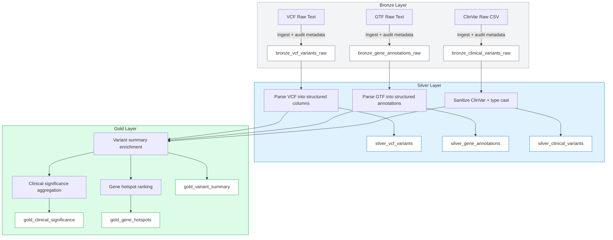

# Genomics ETL Pipeline Diagram

## Notes
- Bronze layer ingests raw genomic files with audit metadata and partitions by `ingestion_date`.
- Silver layer parses and validates raw text into structured Delta tables.
- Gold layer enriches variants, aggregates clinical significance, and ranks gene hotspots.
