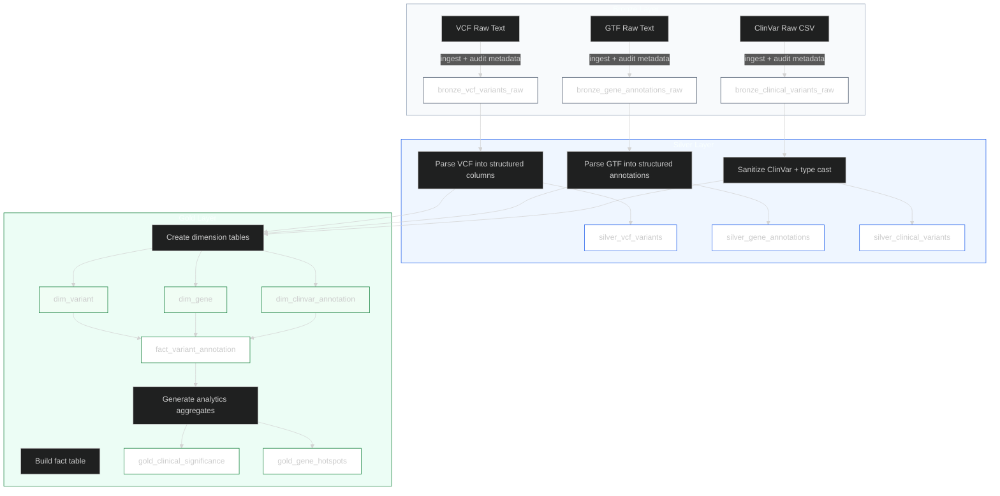
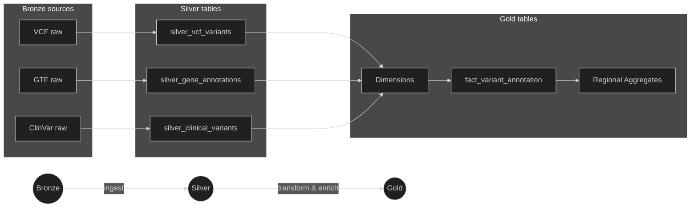
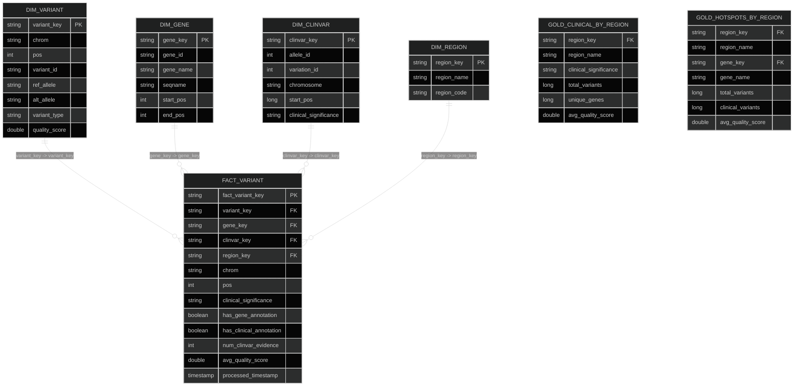

# Genomics ETL Pipeline Diagram

## Updated Data Model

This document now reflects the latest Databricks pipeline design and presents:
- A refreshed medallion pipeline diagram
- Separate dimension table definitions
- Separate fact table definitions
- Clear mapping from Bronze ? Silver ? Gold

---

## Pipeline Flow



---

## Key Notes
- Bronze layer preserves raw source data from VCF, GTF, and ClinVar.
- Silver layer produces typed, cleaned, and partitioned Delta tables.
- Gold layer separates dimensions from facts for analytics-ready modeling.
- The main fact table is `fact_variant_annotation`, supported by `dim_variant`, `dim_gene`, and `dim_clinvar_annotation`.

---

## Dimension Tables

### dim_variant
| Column Name | Type Cast | Key Type |
|---|---:|---:|
| variant_key | string | Surrogate Key |
| chrom | string | - |
| pos | int | - |
| variant_id | string | - |
| ref_allele | string | - |
| alt_allele | string | - |
| variant_type | string | - |
| quality_score | double | - |
| filter_status | string | - |
| is_high_quality | boolean | - |
| bronze_ingestion_timestamp | timestamp | - |
| source_file | string | - |

### dim_gene
| Column Name | Type Cast | Key Type |
|---|---:|---:|
| gene_key | string | Surrogate Key |
| gene_id | string | - |
| gene_name | string | - |
| gene_type | string | - |
| seqname | string | - |
| start_pos | int | - |
| end_pos | int | - |
| strand | string | - |
| length | int | - |
| annotation_source | string | - |

### dim_clinvar_annotation
| Column Name | Type Cast | Key Type |
|---|---:|---:|
| clinvar_key | string | Surrogate Key |
| allele_id | int | - |
| variation_id | int | - |
| chromosome | string | - |
| start_pos | long | - |
| gene_symbol | string | - |
| gene_id | int | - |
| clinical_significance | string | - |
| review_status | string | - |
| phenotype_list | string | - |
| pathogenicity_group | string | - |

### dim_region
| Column Name | Type Cast | Key Type |
|---|---:|---:|
| region_key | string | Surrogate Key |
| region_name | string | - |
| region_code | string | - |
| description | string | - |
| source_population | string | - |

---

## Fact Tables

### fact_variant_annotation
| Column Name | Type Cast | Key Type |
|---|---:|---:|
| fact_variant_key | string | Surrogate Key |
| variant_key | string | FK |
| gene_key | string | FK |
| clinvar_key | string | FK |
| chrom | string | - |
| pos | int | - |
| variant_id | string | - |
| gene_id | string | - |
| gene_name | string | - |
| clinical_significance | string | - |
| has_gene_annotation | boolean | - |
| has_clinical_annotation | boolean | - |
| num_clinvar_evidence | int | - |
| avg_quality_score | double | - |
| processed_timestamp | timestamp | - |
| region_key | string | FK |
| region_name | string | - |
| sample_population | string | - |

### gold_clinical_significance
| Column Name | Type Cast | Key Type |
|---|---:|---:|
| clinical_significance | string | - |
| total_variants | long | - |
| unique_genes | long | - |
| distinct_positions | long | - |
| avg_quality_score | double | - |
| pathogenic_variant_ratio | double | - |
| rank_by_burden | int | - |

### gold_clinical_significance_by_region
| Column Name | Type Cast | Key Type |
|---|---:|---:|
| region_key | string | FK |
| region_name | string | - |
| clinical_significance | string | - |
| total_variants | long | - |
| unique_genes | long | - |
| avg_quality_score | double | - |
| pathogenic_variant_ratio | double | - |
| rank_by_burden | int | - |

### gold_gene_hotspots
| Column Name | Type Cast | Key Type |
|---|---:|---:|
| gene_key | string | FK |
| gene_name | string | - |
| gene_type | string | - |
| total_variants | long | - |
| clinical_variants | long | - |
| snp_count | long | - |
| indel_count | long | - |
| avg_quality_score | double | - |
| hotspot_rank | int | - |

### gold_gene_hotspots_by_region
| Column Name | Type Cast | Key Type |
|---|---:|---:|
| region_key | string | FK |
| region_name | string | - |
| gene_key | string | FK |
| gene_name | string | - |
| total_variants | long | - |
| clinical_variants | long | - |
| avg_quality_score | double | - |
| hotspot_rank | int | - |

---

## Gold Layer Data Flow

1. `silver_vcf_variants` provides core variant details.
2. `silver_gene_annotations` maps variants to genes using range join: `chrom = seqname AND pos BETWEEN start_pos AND end_pos`.
3. `silver_clinical_variants` enriches variants using position join: `chromosome = chrom AND start_pos = pos`.
4. `dim_variant`, `dim_gene`, and `dim_clinvar_annotation` are generated from Silver tables.
5. `fact_variant_annotation` joins all dimensions into a single analytics row.
6. Aggregate tables `gold_clinical_significance` and `gold_gene_hotspots` are computed from the fact table.

---

## Joins (explicit)

- VCF → GTF (range join):

```sql
-- Map variants to genes
SELECT v.*, g.gene_key, g.gene_name
FROM silver_vcf_variants v
JOIN silver_gene_annotations g
  ON v.chrom = g.seqname
  AND v.pos BETWEEN g.start_pos AND g.end_pos
```

- VCF → ClinVar (position join):

```sql
-- Attach clinical annotations by position
SELECT v.*, c.clinvar_key, c.clinical_significance
FROM silver_vcf_variants v
LEFT JOIN silver_clinical_variants c
  ON v.chrom = c.chromosome
  AND v.pos = c.start_pos
```

- Fact → Dimensions (FK joins):

```sql
SELECT f.*, dv.*, dg.*, dc.*, dr.region_name
FROM fact_variant_annotation f
LEFT JOIN dim_variant dv ON f.variant_key = dv.variant_key
LEFT JOIN dim_gene dg ON f.gene_key = dg.gene_key
LEFT JOIN dim_clinvar_annotation dc ON f.clinvar_key = dc.clinvar_key
LEFT JOIN dim_region dr ON f.region_key = dr.region_key
```

---

## Compact Pipeline Diagram



---

## Schema ER Diagram (compact)


